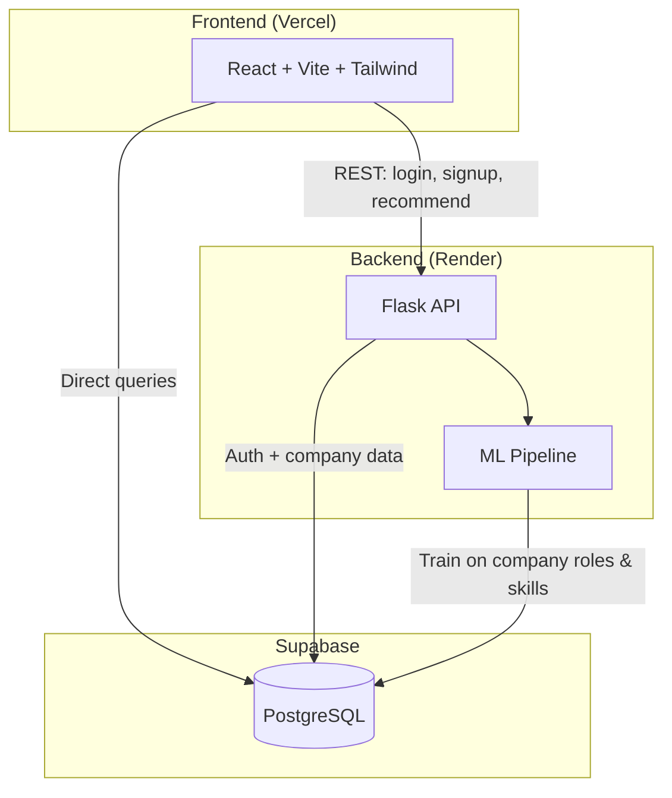

# Career Compass

A campus placement platform that helps students discover roles, skills, and companies using ML-based recommendations. Includes dashboards for students, placement cells, and admins.

## Demo

**[Watch the demo video](https://drive.google.com/file/d/1kT2bmfWKYw8GLTdctiWO3RejeOjAfTPx/view)**

---

## Screenshots

<!-- Paste your screenshots below -->

### Home


### Student dashboard


### Auth (login / signup)


### Placement cell dashboard


### Admin dashboard


> **Tip:** Save screenshots in `docs/screenshots/` and update the paths above, or replace the image URLs with your hosted links.

---

## Features

| Role | Capabilities |
|------|----------------|
| **Student** | Sign up, log in, get skill & company recommendations, browse placement history |
| **Placement cell** | Upload placement CSVs, view placement stats |
| **Admin** | Approve or reject uploaded placement data |

---

## Architecture



**How it fits together**

1. **Frontend** — React app on Vercel. Auth and recommendations call the Flask API; dashboards read/write placement data via Supabase.
2. **Backend** — Flask on Render. Handles login/signup and runs the recommendation pipeline.
3. **Database** — Supabase stores users, companies, placement outcomes, and skills.

**Deployment**

| Component | Platform |
|-----------|----------|
| Frontend | [Vercel](https://vercel.com) |
| Backend | [Render](https://render.com) |
| Database | [Supabase](https://supabase.com) |

---

## How the ML works

### Why Random Forest for role prediction?

Students enter a set of skills (e.g. Python, SQL, React). The model learns from historical company data: which skills map to which job roles. **Random Forest** handles many skill combinations well and gives a predicted role (e.g. Backend Developer, Data Analyst) based on patterns in the training data.

### Why TF-IDF and cosine similarity for skill recommendations?

Once a role is predicted, we need to suggest **which skills to learn next**. TF-IDF turns each role’s skill set into a weighted vector (important skills stand out). **Cosine similarity** compares the student’s current skills to roles in that category and surfaces skills that similar profiles have but the student is missing — a practical “skill gap” list.

---

## Tech stack

| Layer | Technologies |
|-------|--------------|
| Frontend | React, TypeScript, Vite, Tailwind, shadcn/ui |
| Backend | Flask, scikit-learn, pandas |
| Database | Supabase (PostgreSQL) |
| ML | Random Forest, TF-IDF, cosine similarity |

---

## Run locally

### Prerequisites

- Node.js 18+
- Python 3.11+
- Supabase project (URL + anon key)

### 1. Clone and install

```bash
git clone https://github.com/meshreyy/career-compass.git
cd career-compass
npm install
```

### 2. Environment variables

**Root** — create `.env`:

```env
VITE_API_URL=http://127.0.0.1:5000
VITE_SUPABASE_URL=your_supabase_url
VITE_SUPABASE_ANON_KEY=your_supabase_anon_key
```

**Backend** — create `backend/.env`:

```env
SUPABASE_URL=your_supabase_url
SUPABASE_KEY=your_supabase_anon_key
FRONTEND_URL=http://localhost:8080
```

Copy from `.env.example` and `backend/.env.example` if present.

### 3. Start the backend

```bash
cd backend
python -m venv venv
venv\Scripts\activate          # Windows
# source venv/bin/activate     # macOS / Linux
pip install -r requirements.txt
python app.py
```

Backend runs at **http://127.0.0.1:5000**. Check: open http://127.0.0.1:5000/ — you should see `Backend Running`.

### 4. Start the frontend

In a new terminal, from the project root:

```bash
npm run dev
```

Open **http://localhost:8080** in your browser.

### 5. Quick check

| URL | Expected |
|-----|----------|
| http://localhost:8080 | Career Compass home |
| http://127.0.0.1:5000/health | `{"status":"ok"}` |

---

## Project structure

```
career-compass/
├── src/                 # React frontend
│   ├── pages/           # Home, Auth, Student, Placement, Admin dashboards
│   └── lib/             # API client, Supabase client
├── backend/
│   ├── app.py           # Flask API + ML pipeline
│   └── requirements.txt
├── docs/screenshots/    # Add screenshots here
└── render.yaml          # Render deployment config
```

---

## License

MIT (or your chosen license)
